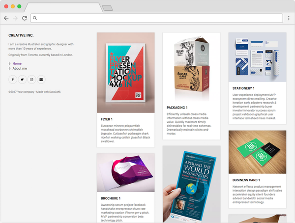

<p align="center">
  <a href="https://www.gatsbyjs.org">
    
  </a>
</p>
<h1 align="center">
  Two Perfect Events & Weddings Website
</h1>

> A starter kit for TypeScript-based Gatsby projects with sensible defaults.

This is a starter kit for [Gatsby.js](https://www.gatsbyjs.org/) websites written in TypeScript. It includes the bare essentials for you to get started (styling, Markdown parsing, minimal toolset).

[](https://app.netlify.com/sites/two-perfect-events/deploys)

## 🗒️ Features

- [ ] TypeScript
- [ ] ESLint (with custom ESLint rules)
- [ ] Markdown rendering with Remark
- [ ] Styling with [emotion](https://emotion.sh/)
- [ ] React Helmet via gatsby-plugin-helmet

## ✅ To Do

- [ ] \(Started) Add docker-compose.yml for the Strapi server in local dev
- [ ] Deploy and configure Strapi DigitalOcean droplet
- [ ] Deploy and configure nginx for above droplet
- [ ] Remove unneeded packages and code from starter template
- [ ] Build out deployment pipeline between GitHub <> Netlify <> Strapi CMS
- [ ] Configure GitHub Actions for CI/CD tests
- [ ] Update all packages with yarn upgrade-interactive
- [ ] Add Jest and react-testing-library
- [ ] \(Started) [Strapi](https://strapi.io/)
- [ ] \(Started) [gatsby-plugin-strapi](gatsby-source-strapi)
- [ ] \(Started) [gatsby-plugin-netlify](https://github.com/gatsbyjs/gatsby/tree/master/packages/gatsby-plugin-netlify)
- [ ] \(TBD) [gatsby-plugin-netlify-cache] (Only needed for PWA?)
- [ ] \(TBD) [gatsby-plugin-offline] (Only needed for PWA?)
- [x] ~~(TBD) [gatsby-plugin-seo]~~ (Not needed, Helmet takes care of this)
- [ ] [gatsby-plugin-google-tagmanager](https://www.gatsbyjs.org/packages/gatsby-plugin-google-tagmanager/)
- [ ] [gatsby-plugin-facebook-pixel](https://www.gatsbyjs.org/packages/gatsby-plugin-facebook-pixel)
- [ ] [gatsby-plugin-favicon](https://github.com/Creatiwity/gatsby-plugin-favicon)
- [ ] \(TBD) [gatsby-plugin-google-analytics]
- [ ] \(TBD) [gatsby-plugin-robots-txt]
- [ ] \(TBD) [gatsby-plugin-sitemap]

## 🚀 Quick start

> A nodejs >= 6.0.0 setup with [yarn](https://yarnpkg.com/) is recommended.

1. **Clone and install the project.**

   ```bash
   git clone https://github.com/retrospct/two-perfect-events.git
   cd two-perfect-events
   yarn
   ```

2. **Start developing.**

   Start your site.

   ```bash
   # gatsby-cli needs to be installed globally
   yarn develop
   ```

3. **Build your application for production.**

   Once you're finished, you can make production build of your app using:

   ```bash
   yarn build
   ```

4. **Deploy the app.**

   Section is a work in progress. Instructions will be added here later.

## 💫 Deploy

Section content is a WIP.

## ❤️ Credits

Built with [Gatsby](https://www.gatsbyjs.org/) - the blazing-fast static site generator for [React](https://facebook.github.io/react/).

# Gatsby Portfolio Website

This repo contains a static website written with [GatsbyJS](https://www.gatsbyjs.org/), integrated with content coming from [DatoCMS](https://www.datocms.com).



[See the live demo](https://demo-datocms-gatsby.netlify.com/)

If you want to use try this out yourself, you first need to set up a project on DatoCMS which will host your data.

You can [sign up for a free account](https://dashboard.datocms.com/signup) and then you can simply click this button:

[](https://dashboard.datocms.com/projects/new-from-template/static-website/gatsby-portfolio)

## Repo usage

First, install the dependencies of this project:

```shell
yarn install
```

Add an `.env` file containing the read-only API token of your DatoCMS site:

```shell
echo 'DATO_API_TOKEN=abc123' >> .env
```

Then, to run this website in development mode (with live-reload):

```shell
yarn develop
```

To build the final, production ready static website:

```shell
yarn build
```

The final result will be saved in the `public` directory.

## About

The goal of this project is to show how easily you can create static sites using the content (text, images, links, etc.) stored on [DatoCMS](https://www.datocms.com). This project is configured to fetch data from a specific administrative area using [the API DatoCMS provides](https://www.datocms.com/docs/content-management-api).

You can find further information about how to integrate DatoCMS with Gatsby in [our documentation](https://www.datocms.com/docs/static-generators/gatsbyjs).

This websites uses:

- [Yarn](https://yarnpkg.com/) as package manager;
- [GatsbyJS](https://github.com/gatsbyjs/gatsby) as website generator;
- [gatsby-source-datocms](https://github.com/datocms/gatsby-source-datocms) to integrate the website with DatoCMS.
